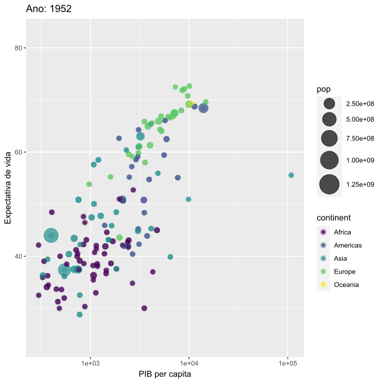

```{r, echo=FALSE}
htmltools::img(src = knitr::image_uri("Imagens/logo.gganimate.png"), 
               alt = 'logo', 
               style = 'position:absolute; top:0; right:200px;height:10vw'
               )
```

<div style="text-align: justify">

  O pacote **gganimate** é uma extensão da gramática de gráficos implementada pelo pacote *ggplot2*, que permite a inclusão de animações. Isso é feito a partir de novas classes gramaticais que podem ser adicionadas ao objeto de plotagem com o intuito de personalizar como ele deve modificar com o tempo. 

</div>

## Instalando e Carregando Pacote

```{r message=FALSE, warning=FALSE}
if(!require(gganimate)){install.packages("gganimate"); require(gganimate)}
```

## Classes Gramaticais

### Transitions

<div style="text-align: justify">

As funções do tipo transition_*() definem como os dados do gráfico devem ser interpretados em relação a dimensão da animação (como devem ser espalhados e como se relacionam com eles mesmos ao longo do tempo).

Além disso, cada uma dessas funções fornece variáveis de rótulo, que representam alguma informação de acordo com o frame atual do gráfico. Essas variáveis podem ser utilizadas a partir da sintaxe do pacote glue, um exemplo do uso delas será mostrado mais a frente.

</div>

```{r, echo=FALSE}
htmltools::img(src = knitr::image_uri("tabelas/transitions.png"),
               style = 'margin-left: 8vw; width: 50vw; align = "center"'
               )
```


### Views

<div style="text-align: justify">

As funções do tipo view_*() definem como os intervalos do sistema de coordenadas mudam ao longo da animação.

</div>

```{r, echo=FALSE}
htmltools::img(src = knitr::image_uri("tabelas/views.png"),
               style = 'margin-left: 3vw; width: 60vw; align = "center"'
               )
```

### Shadows

<div style="text-align: justify">

As funções do tipo shadow_*() definem como os dados de outros pontos no tempo são exibidos no frame atual.

</div>

```{r, echo=FALSE}
htmltools::img(src = knitr::image_uri("tabelas/shadows.png"),
               style = 'margin-left: 12vw; width: 40vw; align = "center"'
               )
```

### Tweening

<div style="text-align: justify">

As funções dessa classe permitem controlar como os elementos gráficos mudam entre os estados. As do tipo enter _ * () e exit _ *() definem como os novos dados devem aparecer e como os dados antigos devem desaparecer durante o curso da animação. Por sua vez, a função easy_aes() define como diferentes estéticas devem ser suavizadas durante as transições.

</div>

```{r, echo=FALSE}
htmltools::img(src = knitr::image_uri("tabelas/tweening.png"),
               style = 'margin-left: 8vw; width: 50vw; align = "center"'
               )
```

### Rendering

<div style="text-align: justify">

As funções dessa classe permitem controlar a renderização de uma animação.

</div>

```{r, echo=FALSE}
htmltools::img(src = knitr::image_uri("tabelas/rendering.png"),
               style = 'margin-left: 10vw; width: 45vw; align = "center"'
               )
```

### Output

<div style="text-align: justify">

As funções dessa classe facilitam o trabalho com a saída de uma animação renderizada.

</div>

```{r, echo=FALSE}
htmltools::img(src = knitr::image_uri("tabelas/output.png"),
               style = 'margin-left: 10vw; width: 45vw; align = "center"'
               )
```

## Gráficos Ilustrativos

#### Gráfico de Bolhas Expectativa de Vida versus PIB per capita (pacote gapminder)

* *transition_time(year)* : estabelece transição das variáveis ao longo dos anos;

* *view_follow(fixed_y = TRUE)* : torna o eixo Y fixo e permite que o eixo X se modifique de acordo com os dados de cada ano;

* *labs(title = "Ano: {frame_time}")* : utilização de rótulo de plotagem para especificar ano do gráfico.


```{r eval=FALSE}
ggplot(gapminder,aes(x = gdpPercap, y=lifeExp, size = pop, colour = continent)) +
  geom_point(show.legend = TRUE, alpha = 0.7) +
  scale_color_viridis_d() +
  scale_size(range = c(2, 12)) +
  scale_x_log10() +
  labs(x = "PIB per capita", y = "Expectativa de vida")+ 
  geom_jitter(alpha = 1/3, size = 3)+
  transition_time(year) +
  labs(title = "Ano: {frame_time}") +
  view_follow(fixed_y = TRUE)
```


#### Gráfico de Linhas Temperatura ao longo dos dias do mês (pacote airquality)

* *transition_reveal(Day)* : faz com que os dados apareçam gradualmente de acordo com a variável dia;

* *geom_point(aes(group = seq_along(Day)))* : acrescenta ponto na temperatura de cada dia dos diferentes frames.

```{r eval=FALSE}
airquality <- airquality %>% mutate(Month = as.factor(airquality$Month)) %>%
  rename(Mês = Month)

ggplot(airquality,aes(Day, Temp, color = Mês)) +
  geom_line() +
  scale_color_viridis_d() +
  labs(x = "Dia do Mês", y = "Temperatura") +
  theme(legend.position = "top") + geom_point(aes(group = seq_along(Day))) +
  transition_reveal(Day)
``` 


#### Gráfico de Barras Temperatura Média por Mês (pacote airquality)

* *transition_states(Mês, wrap = F)* : divide os dados de acordo com os meses,apresentando o gráfico de acordo com cada nível e fazendo uma pausa entre cada mês;

* *shadow_mark()* : permite que as barras dos meses anteriores permaneçam no gráfico;

* *enter_grow()* : informação de cada barra entra no gráfico crescendo;

* *enter_fade()* : faz com que os elementos apareçam gradualmente durante a transição dos meses.

```{r eval=FALSE}
airquality_temp_med <- airquality%>%
  group_by(Mês) %>%
  summarise(Temperatura = mean(Temp))

ggplot(airquality_temp_med,aes(x=Mês,y=Temperatura,fill=Temperatura))+ 
  geom_col()+ 
  transition_states(Mês, wrap = F) +
  shadow_mark() +
  enter_grow() +
  enter_fade()
```


## Renderização

No pacote *gganimate*, assim como no pacote *ggplot2*, a renderização é feita automaticamente quando o objeto *gganim* é impresso. Nesse processo, a função **animate()** é chamada internamente, sendo assim responsável por renderizar os frames e passá-los para as funções de renderização, que se encarregam de combiná-los em uma animação final.

### Argumentos animate()

Ao imprimir um objeto, a função *animate()* utiliza alguns argumentos padrões, por exemplo:

* nframes : número de frames a renderizar (default 100);
* fps : taxa de frames na animação, expressa em frame/segundo (default 10);
* device : dispositivo utilizado para renderizar cada frame. Pode ser  'png', 'jpeg', 'tiff', 'bmp', 'svg' e 'svglite', sendo o 'png' o padrão;
* renderer: função utilizada para renderizar os frames em uma animação (default gifski_render).

Caso deseje alterar esses padrões, você tem as seguintes opções:

* chamar a função *animate()* diretamente, especificando o objeto gganim e os valores dos argumentos que deseja alterar;
* modificar os padrões configurando novos, pelo código options(gganimate.\<argumento\> = \<valor\>).

```{r eval=FALSE}
# primeira opção
animate(objeto_gganim, device = 'svg')
# segunda opção
options(gganimate.device = 'svg')
```

### Suporte para knitr

É possível especificar os argumentos da função *animate()* nas opções do chunk ao usar gganimate com knitr. Dessa maneira, esses argumentos vão ter preferência em relação o padrão, mas não sobre os especificados diretamente na função *animate()*.

Os argumetos devem ser fornecidos em forma de lista, como *{r, gganimate = list(nframes = 50, fps = 20)}*. As opções de knitr nativas suportadas são:

* dev: irá define o dispositivo;
* dev.args: define argumentos adicionais para o dispositivo (...);
* fig.width, fig.height, fig.asp, fig.dim: define a largura e a altura do dispositivo.

### Exemplos

#### Comparando svg e png como renderizador de cada frame

##### Gráfico em svg
 

##### Gráfico em png


#### Renderizando em formato de vídeo

```{r eval=FALSE}
airquality <- airquality %>% mutate(Month = as.factor(airquality$Month)) %>%
  rename(Mês = Month)

gv <- ggplot(airquality,aes(Day, Wind, color = Mês)) +
  geom_line() +
  scale_color_viridis_d() +
  labs(x = "Dia do Mês", y = "Vento") +
  theme(legend.position = "top") + geom_point(aes(group = seq_along(Day))) +
  transition_reveal(Day)

animate(gv,device = 'png',renderer = av_renderer())
```

<video controls>
  <source src="Videos/animgv.mp4" type="video/mp4">
</video>

## Salvando animação

Animações podem ser salvas usando a função *anim_save()*. Usando ela você pode especificar o objeto da animação que deseja salvar, ou como padrão ela irá salvar a última animação feita.

```{r eval=FALSE}
# Exemplo salvando gráfico gv em formato de gif
anim_save("animgv.gif",gv)
```


## gganimate no Shiny 

<div style="text-align: justify">

A melhor maneira de construir um gráfico animado no Shiny utilizando algum input é criando um gif a partir do gráfico pronto. Para isso, você deve utilizar a função *imageOutput()* no ui para apresentar o gif, e a função *anim_save()* no server para salvar o gráfico animado em formato de gif. Segue abaixo um exemplo simples inspirado em uma solução apresentada no site stackoverflow.

</div>

```{r eval=FALSE}
library(gapminder)
library(shiny)
library(gganimate)

ui <- basicPage(
  column(
    width = 5,
    selectInput("var1","Variável eixo x:",choices=c("gdpPercap","pop","lifeExp")),
    selectInput("var2","Variável eixo y:",choices=c("gdpPercap","pop","lifeExp"))
    ),
  column(
    width=7,
    imageOutput("plot1"))
)

server <- function(input, output) {
    
        
    output$plot1 <- renderImage({
        # A temp file to save the output.
        # This file will be removed later by renderImage
        outfile <- tempfile(fileext='.gif')
        
        # now make the animation
        p = ggplot(gapminder, aes(x=get(input$var1),y=get(input$var2),color = continent)) +
          geom_point() + 
          scale_x_log10() +
          transition_time(year)+
          labs(title = "Ano: {frame_time}", x = input$var1,y = input$var2)  # New
        
        anim_save("outfile.gif", animate(p)) # New
        
        # Return a list containing the filename
        list(src = "outfile.gif",
             contentType = 'image/gif'
             # width = 400,
             # height = 300,
             # alt = "This is alternate text"
        )}, deleteFile = TRUE)
    
    }

shinyApp(ui, server)

```

## Animações curiosas

### Ilusão de Óptica


### Fogos de Artifício


## Referências 

### Didática

[1] https://gganimate.com/index.html

[2] https://github.com/ropenscilabs/learngganimate/blob/master/animate.md

### Exemplos

[3] https://rpubs.com/joseli1987/gganimate

[4] https://www.datanovia.com/en/blog/gganimate-how-to-create-plots-with-beautiful-animation-in-r/


### Shiny e Rmarkdown

[5] https://stackoverflow.com/questions/35421923/how-to-create-and-display-an-animated-gif-in-shiny

[6] https://stackoverflow.com/questions/53876485/how-to-render-a-gganimate-graph-in-html-using-rmarkdownrender-without-gener


### Animações curiosas

[7] https://github.com/thomasp85/gganimate/wiki/Optical-Illusion

[8] https://www.data-imaginist.com/2019/gganimate-has-transitioned-to-a-state-of-release/
