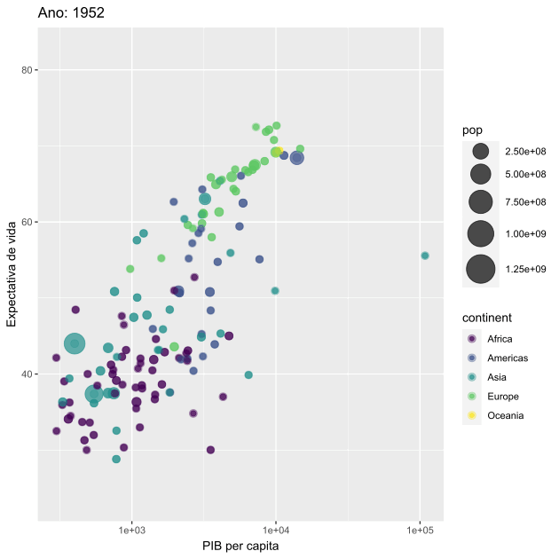

# Pacote gganimate

Esse repositório possui um guia introdutório sobre o pacote **gganimate**, tendo como base [o site oficial do pacote](https://gganimate.com/index.html). O pacote *gganimate* é uma extensão da gramática de gráficos implementada pelo pacote ggplot2, que permite a inclusão de animações. Isso é feito a partir de novas classes gramaticais que podem ser adicionadas ao objeto de plotagem com o intuito de personalizar como ele deve modificar com o tempo.

O material foi construído a partir do *Rmarkdown*, dentro do RStudio, sendo possível acessar seu código no arquivo **.rmd** presente nesse projeto. Caso seja de interesse acessar o material em formato html, que não foi possível disponibilizar por conta do seu tamanho, basta clonar o projeto e rodar o script no RStudio. 

O guia está organizado seguindo a seguinte divisão:

* Instalando e Carregando o Pacote
* Classes Gramaticais
  + Transitions
  + Views
  + Shadows
  + Tweening
  + Rendering
  + Output
* Gráficos Ilustrativos
* Renderização
  + Argumentos animate()
  + Suporte para knitr
  + Exemplos
* Salvando animação
* gganimate no Shiny
* Animações Curiosas
  + Ilusão de Óptica
  + Fogos de Artifício
* Referências
  + Didática
  + Exemplos
  + Shiny e Rmarkdown
  + Animações curiosas
